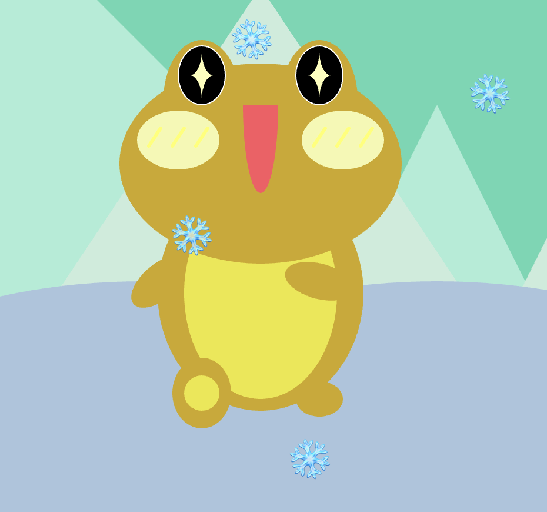

## Art Jam Response

by Aliyah Renomeron-Ward (૭ ｡•̀ ᵕ •́｡ )૭

## Norah's Art Jam: 
> The first project I looked at was Norah's. Her Art Jam portrait was that of a cat, whose eye follows the position of the mouse across the screen. The cat appears to be shrugging as its eye moves, which adds a cool and expressive personality to her portrait.

> I thought it was really creative how she designed the portrait and chose to represent herself through an animal rather than a traditional self portrait of her face. It gives the project a playful and unique twist, showing her technical skills with the code that we've learned so far in the program. And the interactive movement of the eye makes it feel more alive and engaging.

[Link to her Art Jam](https://norahwilcox.github.io/CART253/topics/art-jam/)

## Leah's Art Jam:
> Leah's Art Jam was super interesting. Like Norah's, it wasn't a traditional self portrait like you'd expect, but a wall of cascading, multicolored stars that gets faster the longer you stay on the page. Rather than showing herself literally, she gave us a bit of an insight to her personality and artistic identity through her Art Jam submission. 

> What stood out to me was her approach to the user interaction element, in the sense of its indirect user interaction. There's no clicking or dragging involved, but a more subtle form of engagement. Despite the stars increasing in speed the longer you stay on the page, it felt calm and almost meditative. 10/10! 

[Link to her Art Jam](https://leahiscoding.github.io/CART-253/art-jam)

## Weini's Art Jam:
> Weini's Art Jam was really incredible. The thought and dedication that she put into it was really amazing. I unfortunately did not get a look at her code, but the elements she had were super impressive. It portrays a frog in some kind of snow biome, where there's snowflake emojis falling from the sky. Whenever you move your mouse around, the blush on the frog's cheeks changes color and whenever you press a mouse button, the frog blinks. And the animation is incredibly smooth too. I could tell she put a lot of thought into it and really took her time to capture her vision in her Art Jam. It sort of inspired me for future projects as well.

[Link to her Art Jam](https://bbwinnie.github.io/cart253/topics/assignment/art-jam)