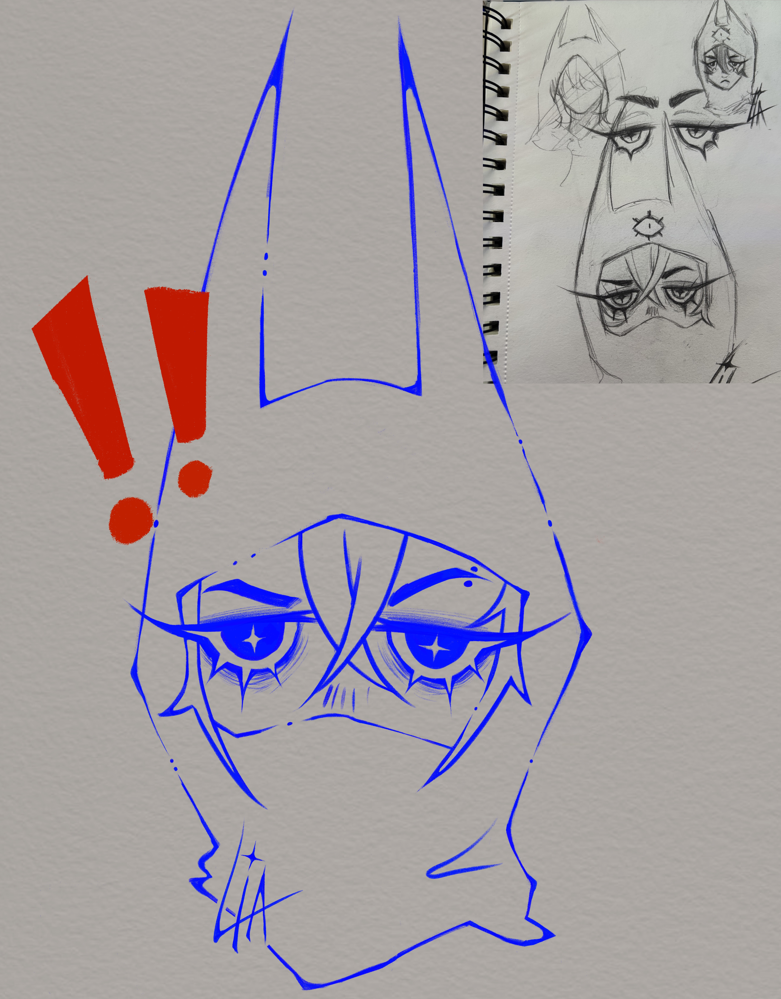
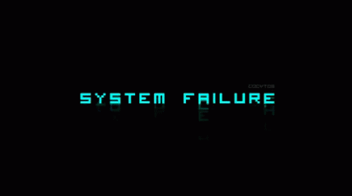

# PERSONA.exe

by Aliyah Renomeron-Ward (૭ ｡•̀ ᵕ •́｡ )૭

[View this project online](https://xp30n.github.io/CART-253/topics/art-jam)

## Booting Persona.exe...Access Granted ⚠

> Welcome to the self portrait that hides as much as it reveals, starring back from behind the code.

> Persona.exe is my self-portrait as a digital alter ego, recreated with p5.js. The mask conceals, the eyes reveal, and the code brings it all together.

## Screenshots 🛸

> Here are a few screenshots and images of the concept art I made!

> 
> 
> 

## Finished Project ➤

> ![final product]

## Attribution 🌀

> - This project uses [p5.js](https://p5js.org).

## System failure: Persona.exe offline 🚫

⠀⠀⠀⠀⠀⠀⠀⠀⠀⠀⠀⠀⠀⠀⠀⠀⠀⠀⠀⠀⠀⠀⠀⠀⠀⠀⠀⠀⠀⠀⠀⠀⠀