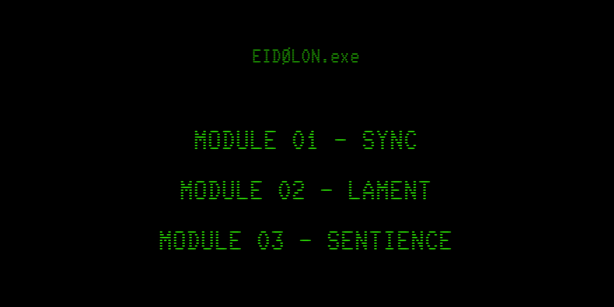

# ❗️ EIDØL0N.exe — VARIATION JAM

Author: Aliyah R.W. (Lia!)
FALL 2025

[View this project online](https://xp30n.github.io/CART-253/topics/eidolon-boot)

## 🖥️ Overview

EIDØL0N.exe is a retro-inspired, terminal-style interactive experience built in p5.js.
The project explores themes of identity, machine sentience, and autonomy—drawing aesthetic and narrative inspiration from classic cyberpunk fiction book “I Have No Mouth, and I Must Scream” by Harlan Ellison. 

The program is structured into three interactive modules, each introduced with a typing-effect narrative sequence followed by a short minigame. Completing all three modules returns the system to the main terminal.

## Screenshot

> 

## 🧩 Core Features

### Retro/Cyberpunk CRT-inspired UI

Neon-green terminal text, glitch-adjacent prompts, and modular “boot protocol” animations.

### Dynamic Typing System

All narrative text is loaded from a JSON file (module1.json) and displayed with a typewriter animation synced to sound effects.

### Three Fully Playable Minigames

Each module uses different mechanics taught in class (variables, arrays, loops, collision, timing, conditionals):

## MODULES

### 🟢 MODULE 01 — SYNC

Minigame: Skill-check timing bar

A slider bounces across a horizontal bar.

Player must press SPACE while inside the green sync zone.

Each successful sync shrinks the zone + increases speed.

After 3 successful checks → module complete

### 🔷 MODULE 02 — LAMENT

Minigame: Falling memory fragments

Hollow, glowing squares fall from the top of the screen.

Player presses SPACE when a fragment aligns with the target bar.

Inspired by “piano tiles” timing logic.

After stabilizing 3 fragments → module complete.

### 🔶 MODULE 03 — SENTIENCE

Minigame: Signal tracing

Three nodes flicker red; one is randomly designated as the green target node.

Player must press SPACE when the active flashing node is the green one.

After 3 correct signals → the system achieves “sentience.” 

### 🚩 HIDDEN SCREEN

CLASSIFIED SYSTEM OUTPUT

▓▓▓▓▓▓▓▓▓▓▓▓▓▓▓▓▓▓▓▓▓
▓▓ CONTENT REMOVED ▓▓
▓▓▓▓▓▓▓▓▓▓▓▓▓▓▓▓▓▓▓▓▓

## 🧪 How to Play

Click one of the three modules on the main menu.

Let the “BOOT PROTOCOL” complete.

Advance intro text with any key.

Play each module’s minigame using SPACE.

Complete the module to return to menu.

Finish all three to complete the experience.

## Attribution

Visual and interface inspiration comes from cyberpunk UI design and CRT terminal aesthetics.

Narrative and thematic inspiration is drawn from Harlan Ellison’s short story *I Have No Mouth, and I Must Scream* (1967).

Elements used:

> - This project uses [p5.js](https://p5js.org)
> - All audio used are royalty free sound effects taken from YouTube: [Sound Effects](https://www.youtube.com/watch?v=04vhD6tNnj8)

## License

> This project is licensed under a Creative Commons Attribution ([CC BY 4.0](https://creativecommons.org/licenses/by/4.0/deed.en)) license with the exception of libraries and other components with their own licenses.