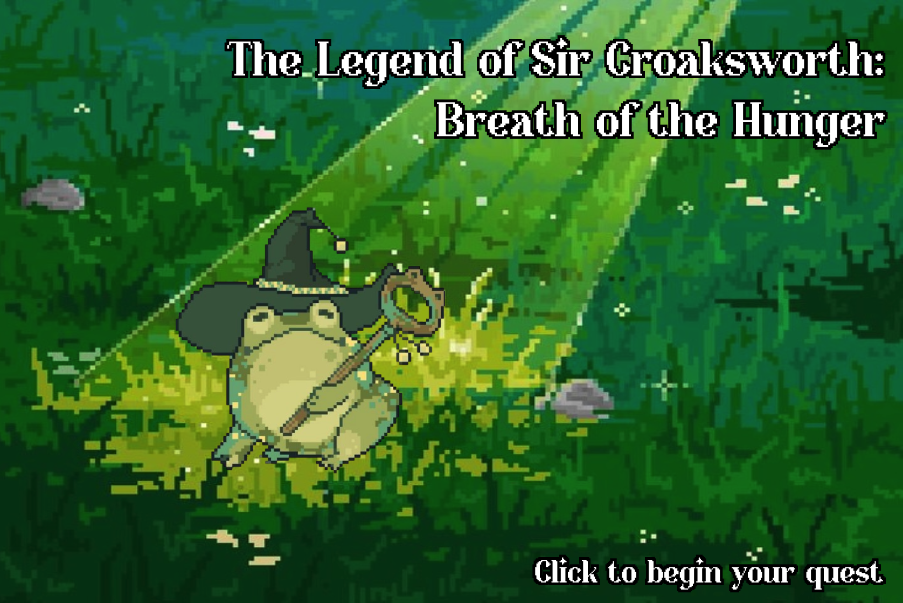
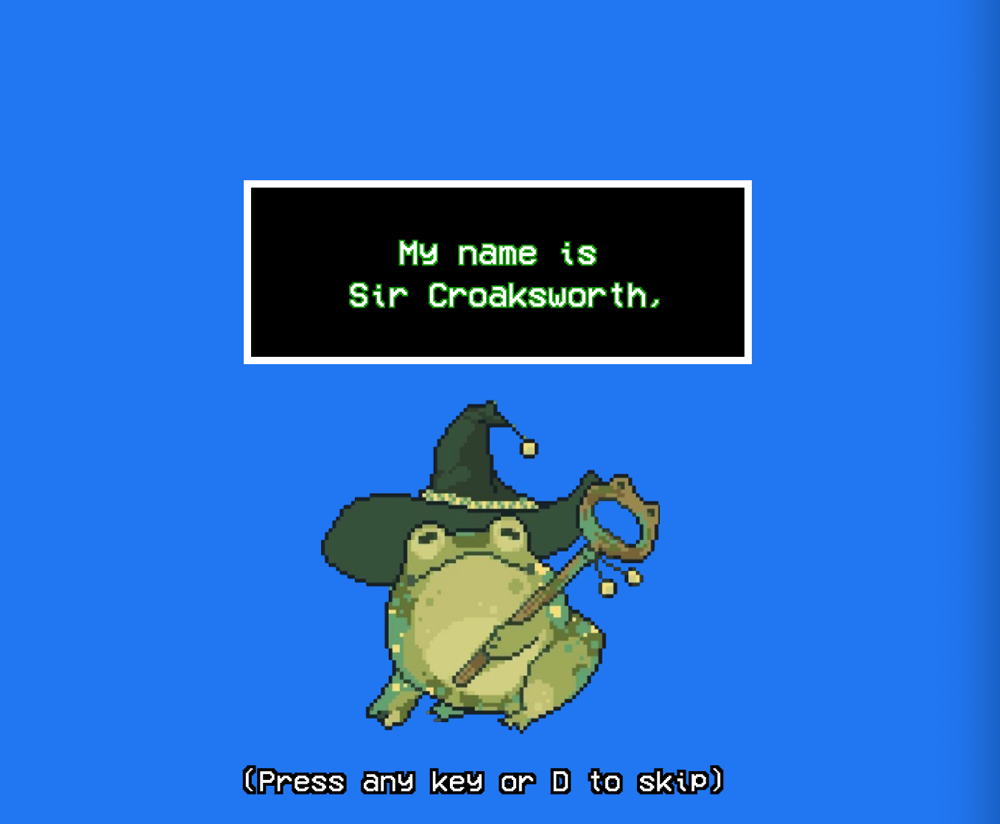
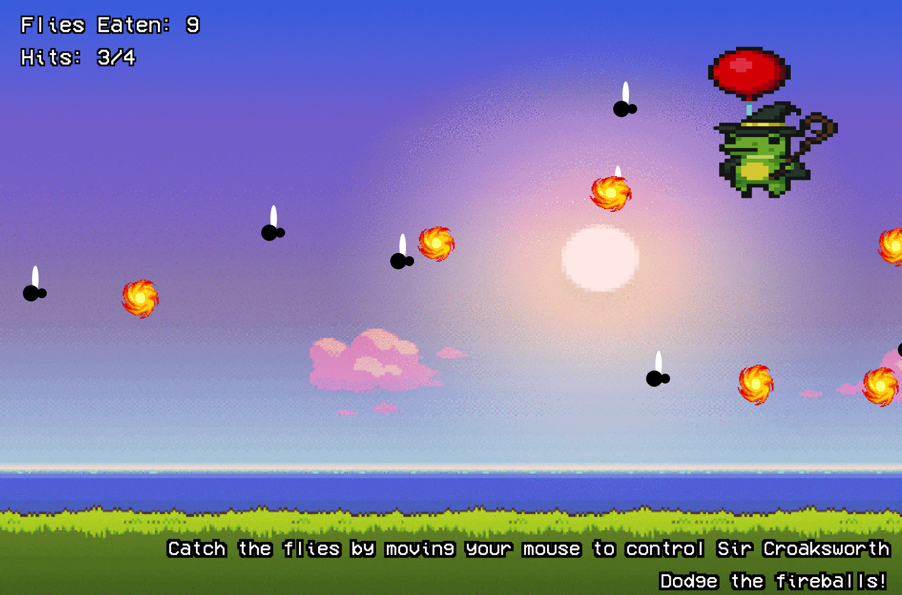

# THE LEGEND OF SIR CROAKSWORTH: BREATH OF THE HUNGER

Aliyah R.W

[View this project online](https://xp30n.github.io/CART-253/topics/mod-jam)

## Description

> This is the legend of Sir Croaksworth.

> *He is an ancient wizard* who has been in a coma for quite some time now! But he just woke up, only to find you standing there!

> Thus, you must help Sir Croaksworth regain his mana by catching 30 flies so that he may once again be a functioning member of society, while dodging the fireballs that come your way!

## Changes

> Added a title screen
> Added an introduction screen
> Added a scoring system: Player must catch 30 flies, and dodge all the fireballs
> Movement of the Sir Croaksworth by following the mouse position
> Added some gameplay and intro music
> Used both keyboard and mouse functions to progress through the game

## Screenshot(s)

Here are some screenshots of Sir Croaksworth's Adventure

> 
> 
> 

## Attribution

Elements used:

> - This project uses [p5.js](https://p5js.org)
> - Used part of the code from [FrogFrogFrog Project](https://pippinbarr.com/frogfrogfrog)
> - PNGS taken from pinterest

> *Intro music*: Options - Mario Kart Wii OST
Composers: Asuka Hayazaki & Ryo Nagamatsu
Game: Mario Kart Wii

> *Gameplay music*: Mob Psycho 100 OST | GOGO REIGEN! | GOGO霊幻!
by: Kenji Kawai

## License

> This project is licensed under a Creative Commons Attribution ([CC BY 4.0](https://creativecommons.org/licenses/by/4.0/deed.en)) license with the exception of libraries and other components with their own licenses.