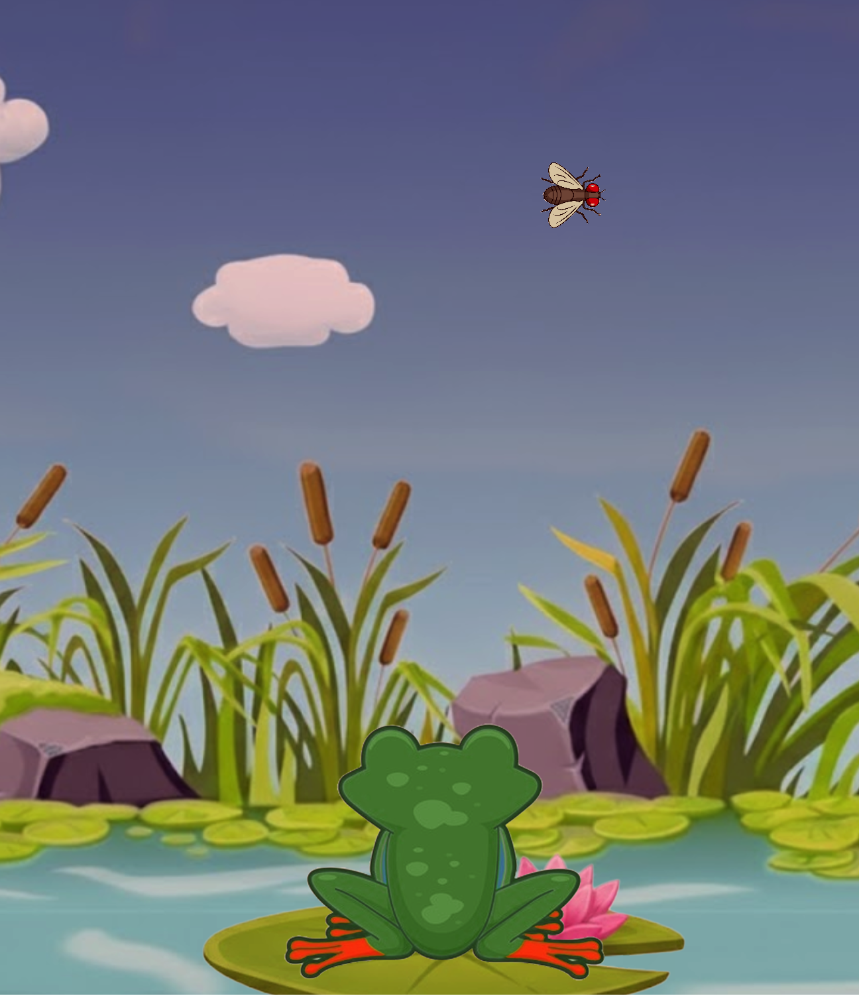
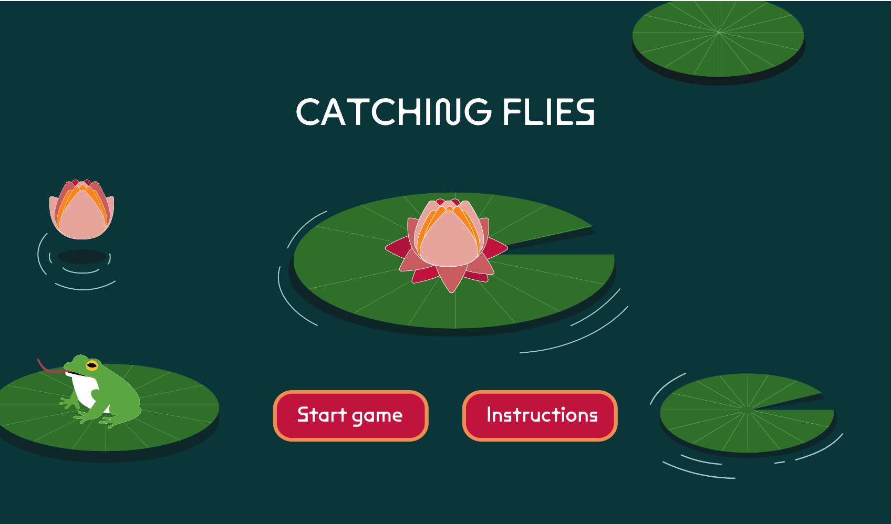

# MOD JAM RESPONSE

### Noureddine's Mod Jam:
> His game was the first that I played. It looks so simple at first but that's what made it weirdly addictive. The visuals helped a lot with that as well. The simple colors and style make everything feel light, calm and cosy. It has this cute vibe that keeps the whole experience fun instead of stressfull. 

> When I loooked through the code, it was actually very easy to follow. Everything is laid out in a way that makes sense, and the variables are named clearly enough that you instantly get what everything means. He definitely put a lot of thought into making his mod jam understandable as well as functional. You can scroll through his code without getting lost. It's simple in the best way, polished and genuinely enjoyable! 

[View this project online](https://rocmazz.github.io/cart253/topics/mod-jam/)

> 

### Ahmad's Mod Jam:
> Ahmad’s mod jam was honestly really fun to play through. The images and music he used gave it this cool “side quest” energy, like something you’d stumble across in an RPG and end up enjoying way more than you expected. The visuals match the mood perfectly, and the sound makes the whole thing feel a bit more immersive even though the game is pretty short.

> His code was also super straightforward. It’s not long, but that actually makes it really easy to understand. Everything is written clearly and organized in a way that lets you follow the logic without getting overwhelmed. It feels like he focused on doing exactly what the game needed and didn’t overcomplicate anything.

> The gameplay itself was short but honestly really sweet. Even with its simplicity, it wasn’t a free win. I needed a few tries to get through it. It has that nice balance of being challenging without feeling frustrating. Overall, it was a small game that left a good impression.

[View this project online](https://ahmadalrazzaz.github.io/cart253/mod-jam/)

> 

### Rayvhaun's Mod Jam
> His mod jam was honestly super calming, almost like slipping into a tiny digital zen garden for a minute. The Minecraft music was the perfect choice. It gives the whole thing this peaceful, nostalgic vibe that pairs really well with the visuals. The frog, the lily pads, even the title screen all looked so polished and pretty. It felt like every element was chosen intentionally to create this soft, relaxing atmosphere, and it totally worked.

> The instructions were also really clear, which made it easy to jump in right away without guessing what to do. Even though the game looks peaceful, it actually requires some timing and focus, which adds a fun layer of challenge. It wasn’t frustrating, just tricky enough to keep me engaged and wanting to retry. Overall, it was a short, sweet experience that felt both relaxing and rewarding.

[View this project online](https://ray-ux514.github.io/ConcordiaRepository/Topics/ModJamFinal/)

> 